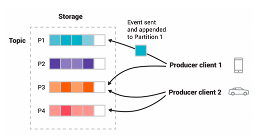

# kafka-study
kafka study

# Introduction

## What is event streaming?
이벤트 스트리밍은 데이터가 데이터를 실시간으로 저장하고 처리하 필요한 곳으로 전달하는 기술입니다. 여
데이터베이스, 센서, 클라우드 서비스 등 다양한 곳에 데이터를 받아 시스템 전반에 걸쳐 데이터를 전달하여 소프트웨어 간 자동화와 상호작용을 지원합니다.
실시간 데이터 흐름을 관리하여 정확한 정보가 필요한 곳에 전송합니다.

카프카는 다음 세 가지 기능을 결합하여 구현합니다..
1. to publish and subscribe to stream of events
2. to store streams of events as long as you want
3. to process streams of events

분산, 확장성, 유여녀성, 내결함성과 보안을 갖춘 데이터 스트리밍 플랫폼으로 
물리 서버, 가상 머신, 컨테이너, 온프레미스 및 클라우드 환경에서 배포할 수 있습니다.

Kafka는 분산 시스템으로, 서버(브로커 및 Kafka Connect)와 클라이언트로 구성됩니다. 
서버는 데이터를 저장하고 다른 시스템과의 데이터 통합을 처리하며, 클러스터는 확장성과 내결함성을 보장하여 서버 장애 시에도 데이터 손실 없이 운영을 지속합니다. 
클라이언트는 분산 애플리케이션과 마이크로서비스가 대규모 실시간 데이터를 처리할 수 있도록 지원하며, Java, Python, Go 등 다양한 언어와 REST API를 제공합니다.

---

### producer
이벤트를 발행하는 클라이언트 애플리케이션

### subscriber
이벤트를 읽고 처리하는 클라이언트 애플리케이션  

  
프로듀서와 컨슈머는 서로 독립적으로 동작하며, 프로듀서는 컨슈머를 기다리지 않아도됩니다.
Kafka는 exactly-once 이벤트 처리와 같은 다양한 보장 기능을 제공합니다.  

### Topic
이벤트가 저장되는 논리적인 단위, 파일 시스템이 폴더와 비슷합니다.  
다수의 프로듀서와 컨슈머를 지원하며, 소비된 메시지가 바로 삭제되지 않고, 설정된 기간 동안 유지됩니다.
데이터의 크기에 비례하지 않고 일정한 성능을 유지해 장기간 데이터 저장이 가능합니다.  

### Partitioning
각 토픽은 여러 파티션으로 나뉘어 여러 브로커에 분산 저장됩니다. 확장성에 중요한 요소로, 여러 클라이언트가 동시에 읽고 쓸 수 있도록 도와줍니다.
동일한 이벤트 키(고객 ID)가 있는 이벤트는 같은 파티션에 저장되고, 컨슈머는 파티션 내 이벤트를 순서대로 읽을 수 있습니다.

모든 토픽은 복제할 수 있어, 브로커 장애나 유지 보수 상황에서도 데이터를 안전하게 보관할 수 있습니다.  

---
# Distribution
## Kafka Consumer와 Offset
오프셋(Offset) 추적:
Kafka 컨슈머는 각 파티션에서 소비한 최대 오프셋을 추적합니다.
오프셋을 **커밋(commit)**하여 재시작 시 마지막으로 소비한 위치에서 다시 시작할 수 있습니다.
1. 오프셋 저장 위치
   Kafka는 **소비자 그룹(Consumer Group)**의 모든 오프셋을 **그 그룹의 지정된 브로커(그룹 코디네이터)**에 저장할 수 있습니다.
   그룹 코디네이터:
   특정 소비자 그룹의 오프셋 커밋 및 조회를 담당하는 브로커입니다.
   소비자 인스턴스는 그룹 코디네이터에 오프셋을 커밋하고 조회합니다.
2. 그룹 코디네이터 조회 과정
   소비자는 FindCoordinatorRequest를 어떤 Kafka 브로커에나 보낼 수 있습니다.
   브로커는 FindCoordinatorResponse를 반환하여 그룹 코디네이터의 세부 정보를 제공합니다.
   이후, 소비자는 해당 코디네이터에 오프셋 커밋 및 조회 요청을 수행합니다.
   만약 그룹 코디네이터가 변경되면, 소비자는 새로운 코디네이터를 재탐색합니다.
3. 오프셋 커밋 방법
   자동 커밋: 설정된 주기마다 Kafka가 자동으로 오프셋을 커밋합니다.
   장점: 코드가 간단하고 관리 부담이 적음.
   단점: 비정상 종료 시 데이터 유실 가능성.
   수동 커밋: 개발자가 명시적으로 오프셋 커밋 시점을 제어합니다.
   장점: 데이터 처리의 신뢰성을 높일 수 있음.
   단점: 코드 복잡성 증가.
   요약
   Kafka의 오프셋 관리 메커니즘은 소비자 그룹 단위로 이루어지며, 그룹 코디네이터를 통해 오프셋 커밋 및 조회가 가능합니다. 상황에 따라 자동 또는 수동 커밋을 선택해 안정적인 데이터 처리가 가능합니다.

---
# 메시지 전달 보장 종류   
### At most once (최대 1회 전달)
메시지가 손실될 수 있지만 중복 전송은 발생하지 않음.
실패 시 일부 메시지가 처리되지 않을 수 있음.
### At least once (최소 1회 전달)
메시지가 중복 전송될 수 있지만 절대 손실되지 않음.
대부분의 경우, 기본적인 Kafka 보장 수준.
### Exactly once (정확히 1회 전달)
각 메시지가 정확히 1회만 처리됨.
주로 Kafka Streams와 0.11.0.0 이상에서의 트랜잭션 지원으로 가능.

